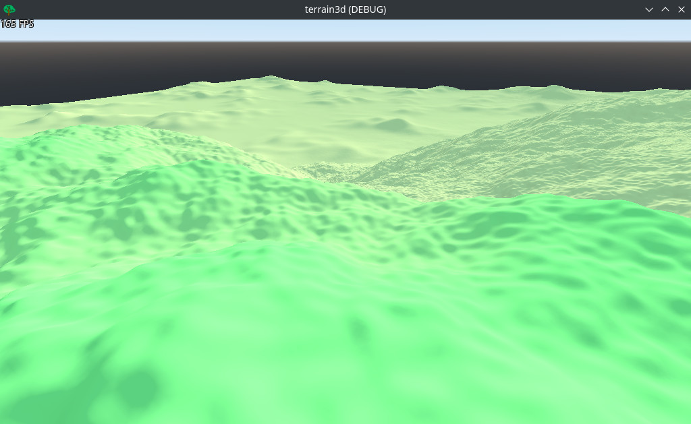
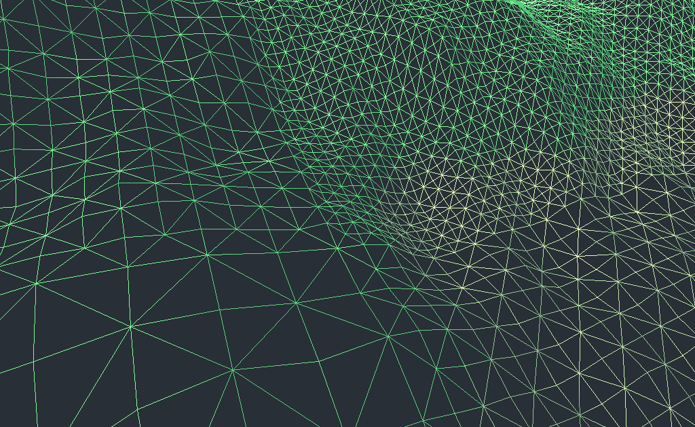

terrain3d
=========

A Godot 3.5 project with procedurally generated 3D terrain partly using GDNative and C++.

It is unfinished and no longer maintained.
Initial version was inspired by a tutorial [Infinite procedural terrain generation](https://www.youtube.com/watch?v=rWeQ30h25Yg) from codat.



Neighboring terrain tiles have their LOD meshes stitched together as illustrated by this wireframe image:



Quickstart
----------

1. Clone this repo, make sure you have `scons` installed and then run inside the cloned directory:
```
git submodule update --init --recursive
cd gdnative/vendor/godot-cpp/
scons platform=linux generate_bindings=yes
cd ../..
scons
```
(replace "linux" with your actual platform of choice)

2. Open in Godot 3.5 and run the project

Use **WASD** for movement and **Escape** to toggle mouse capture.


Known bugs
----------

Occasionally a parent terrain tile remains to be visible even after being split into child tiles.


Alternatives
------------

- [Voxel Tools for Godot](https://github.com/Zylann/godot_voxel) by Zylann
- [HeightMap terrain plugin for Godot Engine](https://github.com/Zylann/godot_heightmap_plugin) by Zylann
- [Terrain Module for Godot Engine 3.5](https://github.com/ozzr/godot_terrain) by ozzr
- [The 'Wandering' Clipmap Terrain Technique (with LOD)](https://www.youtube.com/watch?v=rcsIMlet7Fw) by devmar
- [Official Godot plugin proposal](https://github.com/godotengine/godot-proposals/issues/6121) by reduz
- and probably many more


License
-------

MIT, see [LICENSE.txt](LICENSE.txt)
